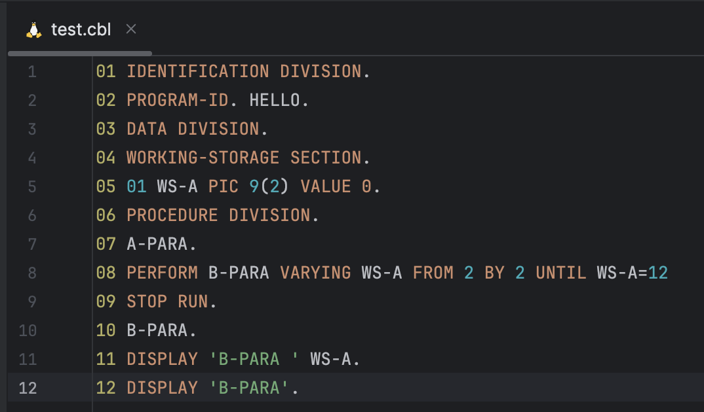

# Minimal COBOL Plugin for IntelliJ IDEA Plugin
The ultimate goal is to build a minimal COBOL plugin in IntelliJ IDEA to parse example code.
```cobol
01 IDENTIFICATION DIVISION.
02 PROGRAM-ID. HELLO.
03 DATA DIVISION.
04 WORKING-STORAGE SECTION.
05 01 WS-A PIC 9(2) VALUE 0.
06 PROCEDURE DIVISION.
07 A-PARA.
08 PERFORM B-PARA VARYING WS-A FROM 2 BY 2 UNTIL WS-A=12
09 STOP RUN.
10 B-PARA.
11 DISPLAY 'B-PARA ' WS-A.
12 DISPLAY 'B-PARA'.
```

# Implementation Approach
1. Follow the [IntelliJ Platform Plugin SDK tutorial](https://plugins.jetbrains.com/docs/intellij/custom-language-support-tutorial.html) before step 5 to set up the initial project.
2. I firstly translate the [lexical syntax of COBLE](https://www.cs.vu.nl/~x/grammars/vs-cobol-ii/index.html#LD) into JFlex format.
3. Combine the JFlex lexer with Grammar-Kit to build the minimal grammar based on [COBOL context-free syntax](https://www.cs.vu.nl/~x/grammars/vs-cobol-ii/index.html#EBNF)

# Run the Plugin
1. Follow the tutorial to install prerequisite plugins
- [ ] DevKit
- [ ] Gradle
- [ ] Grammar-Kit
- [ ] PsiViewer
2. (Optional) Generate the parser and lexer code in Java with Grammar-Kit and JFlex, but to upload full compilable plugin, I've uploaded all the required generated code in the repository.
3. [Run the Gradle task `runIde`](https://plugins.jetbrains.com/docs/intellij/language-and-filetype.html#run-the-project) to launch a new instance of IntelliJ IDEA with the plugin installed.

# Expected Result
